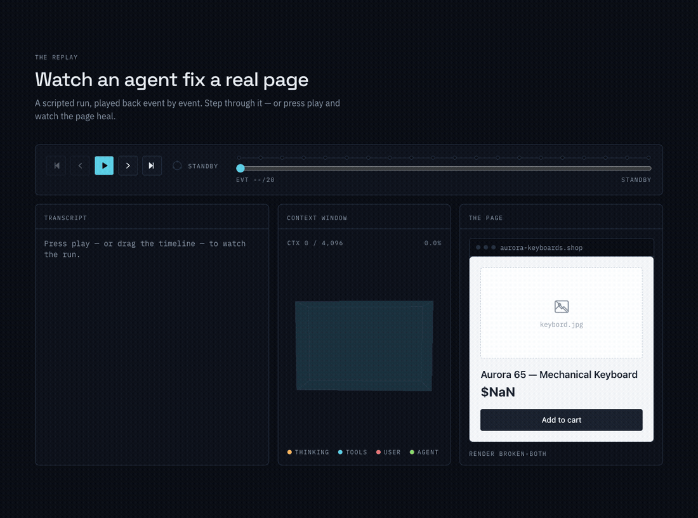
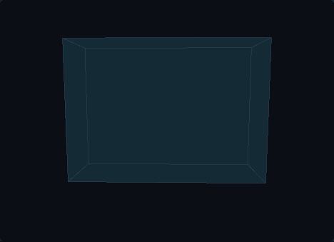
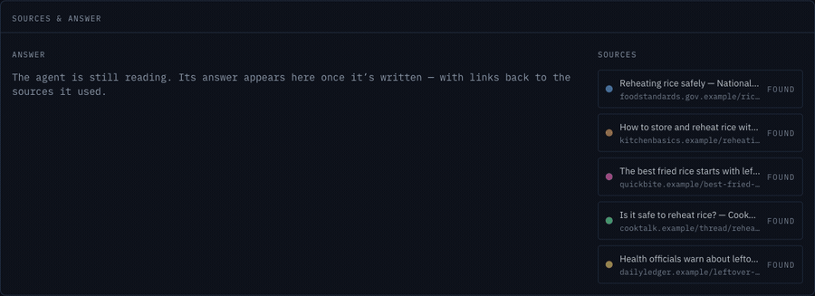
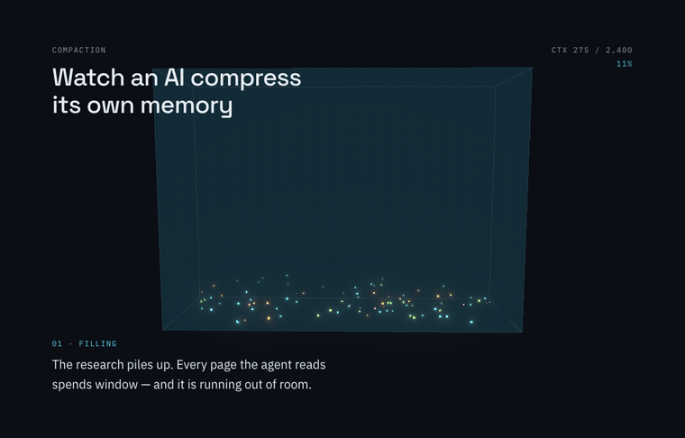

# Agent Anatomy



Interactive visual explainers for how AI systems actually work — in the tradition
of [Bartosz Ciechanowski](https://ciechanow.ski/) and [The Pudding](https://pudding.cool/).

**Episode 01 — [How an AI agent works](https://wenhaoyu-bryan.github.io/agent-anatomy/episodes/how-an-agent-works/).**
The loop, the context window, and what actually happens when you give an AI a task.
Written for a smart reader with no AI background: you scroll, a glass volume fills
with token particles, and then you watch a real(istic) agent run fix a broken
product page — event by event, with the world healing as it works.

> **Live:** https://wenhaoyu-bryan.github.io/agent-anatomy/

## Episode 1.5 — Where agents go wrong



**[Where agents go wrong](https://wenhaoyu-bryan.github.io/agent-anatomy/episodes/where-agents-go-wrong/)**
is the darker companion piece: three ways an agent fails, each a short replay
driven by the same engine.

- **The loop trap** — it edits a file that never takes effect, re-renders, sees no
  change, and tries the same fix again, forever. The transcript rhymes; the meter
  only climbs. Agents don't get frustrated — they get expensive.
- **Context overflow** — reading file after file, the window fills to the brim, then
  the oldest particles (the original request among them) evict out the bottom. The
  agent, having lost the plot, answers confidently — and wrong.
- **A bad observation, caught** — a stale cache says the broken page works. The agent
  nearly believes it, then verifies against the real file, finds the bug, and fixes it.
  The one failure with a happy ending, and it's no accident.

The `1.1` schema adds a `context_evicted` event (which drives the eviction above)
and optional authorial annotations — backward compatible, so every 1.0 trace still
plays. Three new trace files, zero engine forks.

## Episode 02 — How AI reads the web



**[How AI reads the web](https://wenhaoyu-bryan.github.io/agent-anatomy/episodes/how-ai-reads-the-web/)**
is retrieval, made visible. Asked *"is it safe to reheat rice?"* — a question its
training can't answer with confidence — the agent searches, weighs five results,
reads the two most trustworthy, hits one page it **can't read at all** (a
JavaScript-only shell), and writes a short answer whose every claim is threaded
back to the source it came from.

- **The funnel** — the whole web narrows to a handful of results, then to the few
  worth reading, then to fragments flowing into the same context window from Episode 01.
- **Reading a page** — boilerplate falls away and a fragment survives; a page that
  can't be read can't be cited.
- **The replay** — source chips light as pages are read (one dims with an ✕), and the
  answer assembles with curved citation threads reaching back to its sources.

The `1.2` schema adds web `search`, page `fetch` (which may return `unreadable`), a
top-level `sources` registry, and `citations` binding answer spans to sources — and
enforces the thesis in the schema itself: *a source can't be cited unless it was
read.*

## Episode 03 — How agents remember



**[How agents remember](https://wenhaoyu-bryan.github.io/agent-anatomy/episodes/how-agents-remember/)**
is the season finale, and it settles the series' open wound: **context is not
memory.** Context is what's in the window right now; memory is what an agent writes
down *outside* the window so it survives. An agent plans a Tokyo trip across two
sessions — filling the window with research, compacting it into a smaller, lossy
summary, saving notes to a file, and ending the day. The next morning, in a fresh
empty window, it reads those notes back and finishes.

- **Compaction** — a crowded window of research condenses into one dense block,
  rendered smaller *and* dim and desaturated: the visual grammar for lossy
  compression. A summary is a trade.
- **Notes, not neurons** — the window is scratch space that gets wiped; the file is
  the part the agent can count on tomorrow.
- **The replay** — play through the `session_break` and the context window *empties
  completely* while the note persists in the memory panel, then `memory_read` pulls
  it back into a new session.

The `1.3` schema adds `compaction` (compressing context into a lossy summary),
`session_break` (emptying the window), and `memory_read`/`memory_write` (notes that
live outside the window as files) — and enforces that a note is read back
byte-identical to what was written. **Four episodes, one engine, from one
backward-compatible format** — the proof it generalizes.

This repo is two products, and both matter:

1. **The essay** — a scroll-driven, WebGL-powered visual page.
2. **The trace format + replay engine** — a typed, documented JSON schema for
   agent execution traces, plus a headless engine that renders *any* conforming
   trace. Write your own trace, get an interactive replay.

## Write your own trace

A trace is one JSON file describing a complete scripted agent run — the same
shape as real agent transcripts (system prompt → user message → thinking →
tool calls → results → answer), so real session logs can be adapted.

```jsonc
{
  "version": "1.0",
  "meta": { "id": "my-run", "title": "…", "description": "…", "contextWindowTokens": 4096 },
  "tools": [{ "name": "edit_file", "description": "Replace a piece of text in a file." }],
  "initialArtifact": { "kind": "webpage", "files": { "page.html": "…" }, "renderId": "before" },
  "events": [
    { "id": "e01", "type": "user_message", "text": "Fix my page?", "tokens": 18 }
    // … thinking, tool_call, tool_result (with artifact snapshots), assistant_message
  ]
}
```

1. Copy [`traces/example-minimal.trace.json`](./traces/example-minimal.trace.json)
2. Script your scenario — 15–25 events; make the artifact visibly change at least once
3. Validate with `pnpm trace:validate` (CI runs it on every push)

Full spec: [`docs/trace-format.md`](./docs/trace-format.md) ·
JSON Schema: [`docs/trace.schema.json`](./docs/trace.schema.json) ·
The engine: [`src/trace/replay.ts`](./src/trace/replay.ts) (pure, zero React imports,
O(1) scrubbing — unit-tested with Vitest).

## Stack

- Vite 6 + TypeScript (strict), React 19
- React Three Fiber + drei + postprocessing — one canvas, two scenes, selective bloom
- GSAP ScrollTrigger + Lenis for scroll orchestration (both disabled under `prefers-reduced-motion`)
- zustand binding the headless replay engine to the UI
- Tailwind v4 with a CSS-custom-property token system ("flight recorder" identity)
- zod → JSON Schema for the trace format

Everything degrades: no WebGL (or reduced motion) gets a 2D context meter and a
fully readable, non-pinned page. The essay text is prerendered into the HTML at
build time — view-source shows the whole story.

## Develop

```sh
pnpm install
pnpm dev             # dev server
pnpm build           # typecheck + build + SSR prerender
pnpm test            # replay engine unit tests
pnpm trace:validate  # validate all traces against the schema
```

Deployed to GitHub Pages via GitHub Actions on push to `main`. Build notes and
decisions live in [`NOTES.md`](./NOTES.md).

## License

MIT — see [LICENSE](./LICENSE). Made by [Wenhao Yu](https://wenhaoyu-bryan.github.io/).
